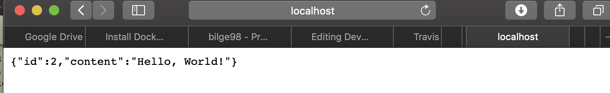

# DevOps
Module DevOps S8 - TP1 

Target application
3-tiers application:
1. Database 
2. Backend API
3. HTTP server


## Création du container database

* Création d'un sous-dossier postgresql
  ```
    mkdir postgresql
    cd postgresql
  ```

* Création d'un fichier Dockerfile et des deux fichiers d'initialisation pour la création et les insert dans les tables
  
  **Dockerfile** :
  
  ```nano Dockerfile```
  
  contenu:
  ```
  FROM postgres:11.6-alpine
  ENV POSTGRES_DB=db \
  
  #init le login et le mdp
  POSTGRES_USER=usr \
  POSTGRES_PASSWORD=pwd
  
  #utilise les scripts sql du dossier courant pour créer et init la db
  COPY *.sql /docker-entrypoint-initdb.d/
  ```
  
  **Fichier de création des tables** :
  
  ```nano 01-CreateScheme.sql```

  contenu:
  ```
  CREATE TABLE public.departments
  (
  id SERIAL PRIMARY KEY,
  name VARCHAR(20) NOT NULL
  );
  CREATE TABLE public.students
  (
  id SERIAL PRIMARY KEY,
  department_id INT NOT NULL REFERENCES departments (id),
  first_name VARCHAR(20) NOT NULL,
  last_name VARCHAR(20) NOT NULL
  );
  ```
  
  **Fichier d'init des tables** :
  
  ```nano 02-InsertData.sql```
  
  contenu:
  ```
  INSERT INTO departments (name) VALUES ('IRC');
  INSERT INTO departments (name) VALUES ('ETI');
  INSERT INTO departments (name) VALUES ('CGP');
  INSERT INTO students (department_id, first_name, last_name) VALUES (1,
  'Eli', 'Copter');
  INSERT INTO students (department_id, first_name, last_name) VALUES (2,
  'Emma', 'Carena');
  INSERT INTO students (department_id, first_name, last_name) VALUES (2,
  'Jack', 'Uzzi');
  INSERT INTO students (department_id, first_name, last_name) VALUES (3,
  'Aude', 'Javel');
  ```
 
* Création de l'image

  ```docker build -t bilge98/postgretp1```
  

* Création du container sur le port 5433 (le 5432 est déjà pris par le serveur apache de ma machine)
  L'option -p permet de préciser les ports extérieurs/hôte et intérieurs au container. Lorsqu'ils sont identiques il n'est pas nécessaire de les préciser mais on peut le faire tout de même.
  On donne au container le nom 'postgres' avec l'option --name. Si aucun nom n'est donné, docker donnera tout de même un nom aléatoire.

  ```docker run -p 5433:5432 --name postgres bilge98/postgretp1```
  

* Mise en place d'adminer pour manager la DB 
  L'option --link lie notre container postgres au container adminer créé.
  ```docker run --link postgres:db -p 8080:8080 adminer```
  
* Persistence des données de la DB lorsqu'on arrête le container *
  L'option -v indique un volume sur le pc à monter avec le volume correspondant côté docker
  ```-v /Users/developpement/Documents/DevOps/TP1/DataPersistent:/var/lib/postgresql/data```
  
* Afin de stopper et supprimer tous les containers *
```docker stop $(docker ps -a -q)```
```docker rm $(docker ps -a -q)```
  

## Création du container API

* Création d'un sous-dossier java
  ```
    mkdir java
    cd java
  ```

* Création d'un fichier Main.java et d'un Dockerfile
  
   **Fichier Main.java** :
  
  ```nano Main.java```
  
  contenu:
  ```
  public class Main {
    public static void main(String[] args) {
      System.out.println("Hello World!");
    }
  }
  ```
  
  **Dockerfile** :
  
  ```nano Dockerfile```
  
  contenu:
  ```
  FROM openjdk:11

  # Copy resource from previous stage
  COPY Main.java ./usr/src
  WORKDIR /usr/src
  # Build Main.java
  RUN javac Main.java

  FROM openjdk:11-jre

  WORKDIR /usr/src
  # Copy resource from previous stage
  COPY --from=0 /usr/src/Main.class .

  # Run java code with the JRE
  RUN java Main
  ```

* Création de l'image main

  ```docker build -t imagejava .```
  
* Génération d'une api avec springboot 
https://start.spring.io en suivant la configuration du sujet de TP

* Création et lancement du container springboot
  
  ```docker run --name containerjava imagejav```

* Création et lancement du container java

  ```docker run -p 8081:8080 imagejava```
  
* On retrouve sur localhost:8081 de notre machine 

  ```{"id":1,"content":"Hello, World!"}```
  
* On modifie le fichier application.yml de notre projet, on rebuild notre api 
  
  ```docker build -t imagejava .```
  et on run notre container java en le liant au container postgres déjà lancé avec adminer :
  ``docker run -p 8081:8080 --name api --link postgres imagejava```

  On peut voir sur ```http://localhost:8081/departments/IRC/students``` :
 ```[{"id":1,"firstname":"Eli","lastname":"Copter","department":{"id":1,"name":"IRC"}}]```

## Création du container Apache

*  On récupère l'image httpd 
  ```docker pull httpd```
  
* La commande ```docker stats``` affiche les containers qui runnent :


* Construction du container et on le map au port 8082 de notre localhost
```docker run -dit --name my-apache-app -p 8082:80 -v "$PWD":/usr/local/apache2/htdocs/ httpd:2.4```

* Mise en place du reverse-proxy

  * Affichage du fichier de conf httpd dans le container
  ```docker exec my-apache-app cat /usr/local/apache2/conf/httpd.conf```
  * Modification du fichier httpd.conf dans lequel on active les modules proxy et proxy http (voir le fichier dans le repo git)

  * Lancement du container apache lié à l'api 
  ```docker run -d -p 80:80 --link api --name my-apache-app apacheimage```
  

  
  
