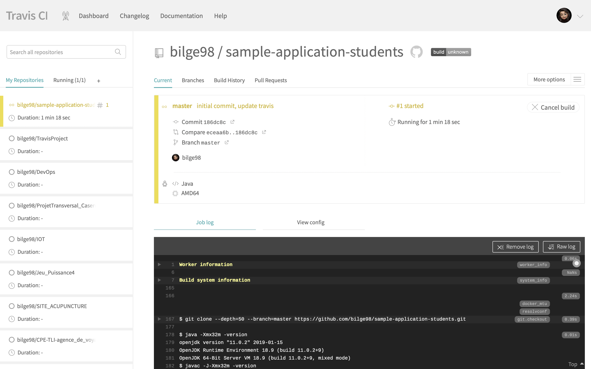
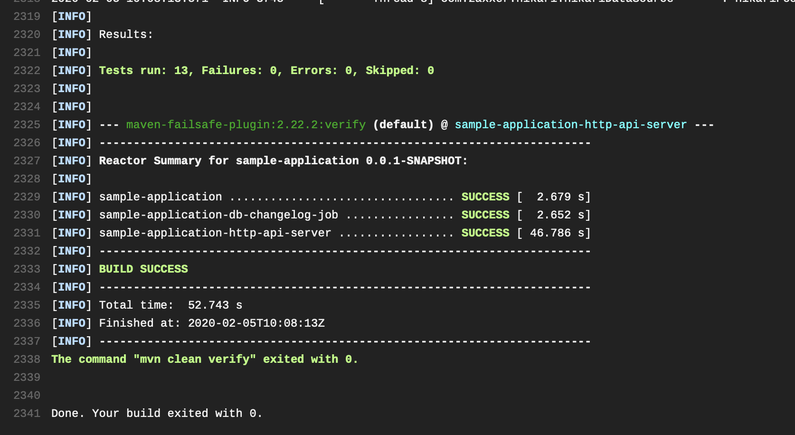
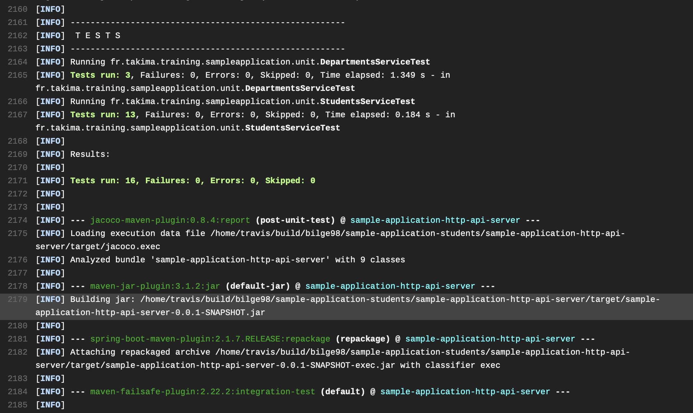

# DevOps

## Module DevOps S8 - TP2 - Travis CI 

* Création de .travis.yml
```
language: java

# services:
#    - docker
   
# before_install:
#     - docker pull postgres:9.6
#     - docker run -d -p 5432:5432 postgres
   
script: 
    - mvn clean verify
```
* Après avoir setup Travis et mis en place le repo Git, on observe dans Travis CI qu'un job a été lancé, directement à partir de notre fichier .travis.yml 



* Le log nous montre que le mvn-clean-verify a été correctement terminé et que les tests ont été réalisés avec succès






